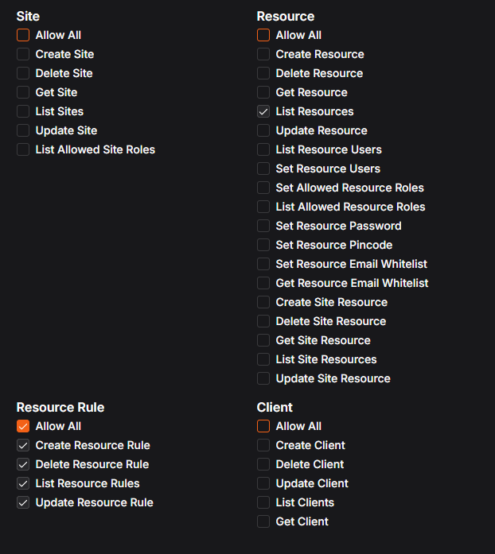

# Pangolin IP Rule Manager

This service serves a 1×1 transparent image at any path ending with .png or .gif. Each request is treated as a heartbeat from the client's IP address, adding an IP Rule in Pangolin for some of your resources. Optionally, it can also allowlist your IP with your crowdsec instance. A background task cleans up the rules if an IP hasn't been seen for a configurable period.

Tested with Pangolin v1.10.3.

---

## Run with Docker Compose (recommended)
1) Clone this repository and change into the directory

```bash
git clone https://github.com/tobkim/pangolin-ip-rule-manager.git
cd pangolin-ip-rule-manager
```

2) Copy config.env.sample to config.env and update the values.
  - PANGOLIN_URL: Your Pangolin API base URL
  - ORG_ID: Your Pangolin organization ID (string)
  - PANGOLIN_TOKEN: API token with the required permissions (see below)
  - RESOURCE_IDS: Comma-separated list of resource IDs to manage (e.g., 2,7,12). The available resource ids cannot be seen anymore in the newer pangolin versions. They are listed in the logs at the start of the container to help you out.
  - Crowdsec Integration: Check the config.env.sample

3) Start the service

```bash
docker compose up -d
```

4) configure a new resource in Pangolin and point it to this container, e.g. a subdomain checkin.yourdomain.com 

5) access https://checkin.yourdomain.com/checkin.png (or /whatever_as_long_as_its_png_or.gif). Your IP should now be in the list of allowed IPs.

---


## Configuration (environment variables)
- `PANGOLIN_URL`: Base URL of Pangolin API (default: `https://api.url.of.your.pangolin.instance`)
- `PANGOLIN_TOKEN`: Bearer token for Pangolin API (required for API actions)
- `ORG_ID`: Pangolin organization identifier used to list resources at startup (default: `your_org_id`)
- `RESOURCE_IDS`: Comma-separated resource IDs (example: `2,7,12`)
- `EXPECTED_PANGOLIN_CUSTOM_HEADER_KEY`: Required. Incoming requests must include this header with the exact value below.
- `EXPECTED_PANGOLIN_CUSTOM_HEADER_VALUE`: Required. Configure the same header in Pangolin on the resource fronting this service.- 
- `RETENTION_MINUTES`: Minutes without seeing an IP before cleanup deletes rules (default: `1440` = 1 day)
- `CLEANUP_INTERVAL_MINUTES`: Cleanup frequency in minutes (default: `60` = 1 hour)

### Optional: CrowdSec integration (allowlist)
- `CROWDSEC_ENABLED`: Set to `true` to enable CrowdSec integration (default: `false`).
- see config.env.sample for other default values

Behavior when enabled:
- On startup, ensure the named allowlist exists (create if needed).
- On each successful `/whatever.png` request, also add the IP to the allowlists.
- When an IP expires per `RETENTION_MINUTES`, remove it from the allowlists during cleanup.

Notes:
- This uses `cscli` on the same Docker host. If CrowdSec runs in a container, ensure this service can run `docker exec crowdsec cscli ...` (e.g., by mounting the Docker socket or running on the host).
- CrowdSec allowlist membership is cached to avoid running commands on every request. If an IP isn't in the cache, the service first verifies the current contents via `cscli allowlist <name> list` before attempting add/remove.
- Commands are attempted across common `cscli` versions; warnings are logged if commands are unavailable.

---


## Key Properties
- Extremely small and simple: Python stdlib only, no external dependencies
- Image endpoints: any path ending with .png or .gif returns a 1×1 transparent image (PNG or GIF). Requests to the root path '/' return 403.
- Security enforcement:
  - Mandatory custom header (see EXPECTED_PANGOLIN_CUSTOM_HEADER_KEY/EXPECTED_PANGOLIN_CUSTOM_HEADER_VALUE) must be present on every request
- IP extraction from `X-Real-IP`, then `X-Forwarded-For`, then socket address
- Pangolin API integration: GET current rules, PUT to add, DELETE to remove
- Persistent state: JSON file (default at `/data/state.json`, persisted via a Docker volume in the provided compose file)
- Background cleanup thread removes stale rules created by this service
- Optional CrowdSec integration: add/remove IPs from a named CrowdSec allowlist via `cscli` (when enabled)

---


---

## Behavior
- On startup, the service fetches and prints the list of resources for `ORG_ID` from Pangolin, showing name and `resourceId` to help you choose `RESOURCE_IDS`.
- `Remote-User` is optional; if present it is logged for traceability.
- If the required custom header (EXPECTED_PANGOLIN_CUSTOM_HEADER_KEY/EXPECTED_PANGOLIN_CUSTOM_HEADER_VALUE) is missing or has a different value, returns `403`.
- On each successful request, the real IP is determined and this service:
  - Updates `last_seen` for that IP in the state file
  - Checks Pangolin rules for each `resourceId` and creates one if missing (rule-existence checks are cached per resource for about 1 hour, configurable)
  - Serves a tiny transparent image (PNG or GIF) depending on the requested file extension
- A background task periodically deletes rules for IPs that this service created once they have not been seen for `RETENTION_MINUTES` minutes.

---

## Notes
- Only rules created by this service are deleted during cleanup. Existing rules discovered as already present are left intact.
- The state is persisted to a JSON file at `STATE_FILE` (default `/data/state.json`). The provided `docker-compose.yml` uses a named volume to persist this data across restarts. You can change or remove the volume mapping if you prefer ephemeral state.

---

## API key permissions (what the token needs)
Make sure the API token you configure has the following minimal permissions:
- Ability to list resources in the organization (read-only)
- Ability to list existing access rules for the specified resources
- Ability to create and delete IP-based access rules for those resources

The following screenshot shows the needed permissions to select:




---

## Integrating via CSS (e.g., Jellyfin)
You can trigger the invisible request to `/banner.png` from web apps (like Jellyfin) using a tiny CSS snippet. This keeps the page unchanged while causing the browser to fetch the image, which lets this service observe the requester IP and manage Pangolin rules.

Replace `https://your-pangolin-ip-rule-manager-domain.com` with your real domain pointing to this service.

```css
body::after {
  content: "";
  position: fixed;
  inset: -9999px;           /* keep it far off-screen */
  width: 1px;
  height: 1px;
  pointer-events: none;
  background-image: url("https://your-pangolin-ip-rule-manager-domain.com/jellyfin-checkin.png");
  background-repeat: no-repeat;
}
```

---

### Disclaimer: AI-generated
- This project was created and is largely maintained with the help of AI assistants. While kept intentionally simple and reviewed for practicality and safety, it may contain mistakes or omissions.
- Always review the code, configuration, and security posture before deploying to production. Use at your own risk.
- Contributions, bug reports, and human review are highly encouraged.

